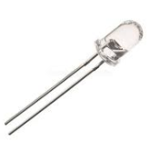

# Android Infrared Remote Control

### IOT using Infrared communication

This is a prototype for the use of infrared communication from android to arduino
This project is created by [Anthony Aniobi](https://github.com/AnthonyAniobi), the motivation of this method of communication came after hours of trying to work with [bluetooth module](https://github.com/AnthonyAniobi/Flutter-home-automation).

Unlike the bluetooth communication method is cheaper and currently the cheapest arduino communication method for android online now.

This project is open for use by anyone who references this initial project.

**Note:** Not all mobile devices support infrared communication. Only devices with `Lidar` Sensors support infrared communication.

Here is a list of all the cell phones (and devices) that Apple produces that utilize LiDAR technology.

- iPhone 14 Pro Max
- iPhone 14 Pro
- iPhone 13 Pro Max
- iPhone 13 Pro
- iPhone 12 Pro
- iPhone 12 Pro Max
- iPad Pro (2020 Version & Later)

Samsung used to use rear-facing LiDAR technology in some of its phones, like the Galaxy S10 5G, S20+, S20, and SOCELL Vizion 33D models

## Technologies Used

- Arduino
- Flutter
- Mobile device (with LiDar sensor)
- Infrared sensor
- Infrared reciever

## Disclaimer

There is no much knowledge on this method of communication especially as is associated with IOT. This may be due to interferance and distortions in communications which may be caused by other remote control appliances. For sensitive communicaiton and security, it is adviced to make use of longer messages(codes). The owner 'Anthony Aniobi' bears rights of ownership but every user can modify and use the project as he/she pleases
